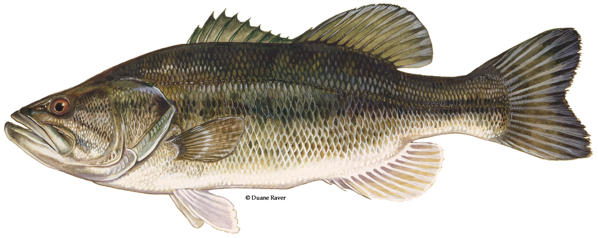

# Bass, Largemouth

Distribution: 
Found throughout the state in ponds, lakes, rivers and streams. Both state and federal hatcheries stock most Oklahoma waters with these powerful fighters. The Florida subspecies of largemouth bass have been stocked in many reservoirs and will interbreed with native largemouth bass. These hybrids grow rapidly and produce trophy-size fish.
Black bass is a general term referring to largemouth, spotted and smallmouth bass and their hybrids. The three species are similar, but can be easily identified. Since water clarity can affect the color of a fish , color is not a reliable way to tell the basses apart. The most objective way to tell these species apart is by the relationship of the eye and the mouth hinge. On a spotted bass, the mouth hinge lines up vertically with the back edge of the eye; on a smallmouth bass, the mouth hinge vertically lines up in front of the back edge of the eye; and on a largemouth bass, the mouth hinge vertically lines up behind the back edge of the eye.  

Largemouth bass Identification: - Mouth hinge is well behind eye - Most do not have a tooth patch on their tongue - The first and second dorsal fins are barely connected

Habitat: 
During the spring, largemouth bass are found in shallow, weedy habitat where food and cover are available. During the hot days of summer and cold winter months, these fish move to deeper water.

Natural Food Sources: 
Crustaceans, insects, crayfish, frogs and fish

Spawning: 
Spawning activities begin as water temperatures reach 62 to 65 degrees F. (April and May in Oklahoma). Nests are fanned out by males, usually within 10 feet of the shoreline. Females then deposit 2,000 to 7,000 eggs per pound of body weight in the nest. After fertilization, the male drives the female and any other intruders from the nest until the eggs hatch and the fry leave. Fry swim in schools until reaching a length of approximately one inch.

Facts: 
Largemouth bass are the most sought after game fish in Oklahoma. A highly predatory fish, they will strike an assortment of artificial lures as well as natural bait. Because they help control smaller sunfish populations, the "overharvest" of bass (removing too many), especially on small lakes and ponds, should be avoided. Some Oklahoma lakes have size limits on bass to protect them from overharvest. Check local as well as state regulations for possible size limits before fishing an unfamiliar lake.

